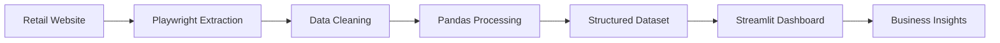

# ⚡ High-Frequency E-Commerce Tracker

### Real-Time ETL Engine for Competitive Pricing Intelligence

<p align="center">
  
  
  
  
</p>

---

## 📌 Overview

The **High-Frequency E-Commerce Tracker** is a real-time ETL platform built for market intelligence, competitive pricing analysis, and e-commerce monitoring.

The application continuously scans online retail catalogs, processes pricing information, and delivers actionable insights through an interactive dashboard.

By leveraging modern browser automation techniques, the platform can interact with dynamically rendered websites, collect structured product data, and transform it into business intelligence.

---

## 🎯 Business Context

In highly competitive technology and e-commerce markets, pricing changes occur constantly. Traditional scraping approaches based solely on HTTP requests often fail when facing dynamically rendered content and modern website protection mechanisms.

This project adopts a browser automation architecture powered by Playwright, allowing the system to interact with web pages similarly to a real user and extract reliable market data directly from online storefronts.

### Key Benefits

* 📈 Competitive pricing intelligence
* ⚡ Real-time data collection
* 🛒 Automated catalog monitoring
* 📊 KPI generation and visualization
* 🔄 End-to-end ETL workflow
* 🌐 Dynamic content extraction

---

## 🏗️ System Architecture

The platform follows a classic ETL pipeline composed of three integrated stages:

```text
┌─────────────┐
│   Extract   │
└──────┬──────┘
       │
       ▼
┌─────────────┐
│ Transform   │
└──────┬──────┘
       │
       ▼
┌─────────────┐
│    Load     │
└─────────────┘
```

### 1️⃣ Extract — Browser Automation Layer

* Asynchronous Playwright execution
* Native Microsoft Edge integration
* Dynamic page rendering
* Infinite scrolling support
* Lazy-loading handling
* DOM extraction and parsing

### 2️⃣ Transform — Data Processing Layer

* HTML sanitization
* String normalization
* Currency conversion
* Data validation
* Dataset structuring with Pandas

### 3️⃣ Load — Visualization Layer

* Real-time dashboard rendering
* Interactive tables
* Pricing trend visualization
* KPI calculations
* Product access links

---

## 🛠️ Technology Stack

| Technology | Purpose                 |
| ---------- | ----------------------- |
| Python     | Core Application        |
| Playwright | Browser Automation      |
| Pandas     | Data Processing         |
| Streamlit  | Dashboard Interface     |
| AsyncIO    | Asynchronous Operations |

---

## 📂 Project Structure

```bash
ecommerce-tracker-etl/
│
├── dashboard.py
├── requirements.txt
├── scraper/
│   ├── extract.py
│   ├── transform.py
│   └── load.py
│
├── data/
├── assets/
└── README.md
```

---

## 🚀 Installation

### Prerequisites

Before starting, make sure you have:

* Python 3.10 or higher
* Microsoft Edge installed
* Git installed

---

### 1. Clone the Repository

```bash
git clone https://github.com/blackgamer_07/ecommerce-tracker-etl.git

cd ecommerce-tracker-etl
```

---

### 2. Create a Virtual Environment

#### Windows

```bash
python -m venv venv

venv\Scripts\activate
```

#### Linux / macOS

```bash
python -m venv venv

source venv/bin/activate
```

---

### 3. Install Dependencies

```bash
pip install -r requirements.txt
```

---

### 4. Install Playwright Components

```bash
playwright install
```

---

### 5. Launch the Dashboard

```bash
streamlit run dashboard.py
```

---

## 📊 Dashboard Features

* Product catalog monitoring
* Real-time price tracking
* Average price calculation
* Pricing trend analysis
* Product links
* Data filtering and sorting

---

## 🔄 ETL Workflow



---

## 📈 Use Cases

### Market Intelligence

Track competitor pricing and identify market opportunities.

### E-Commerce Monitoring

Monitor products and pricing fluctuations in real time.

### Business Analytics

Generate pricing KPIs and comparative analysis.

### Competitive Research

Analyze product positioning and market behavior.

---

## 🔒 Reliability Features

* Dynamic content support
* JavaScript-rendered page handling
* Lazy-loading compatibility
* Asynchronous processing
* Data validation pipeline
* Fault-tolerant workflow

---

## 🤝 Contributing

Contributions are welcome.

1. Fork the repository

2. Create a feature branch

```bash
git checkout -b feature/new-feature
```

3. Commit your changes

```bash
git commit -m "Add new feature"
```

4. Push to the branch

```bash
git push origin feature/new-feature
```

5. Open a Pull Request

---

## 📄 License

This project is licensed under the MIT License.

---

<p align="center">
Built with ❤️ using Python, Playwright, Pandas and Streamlit
</p>
